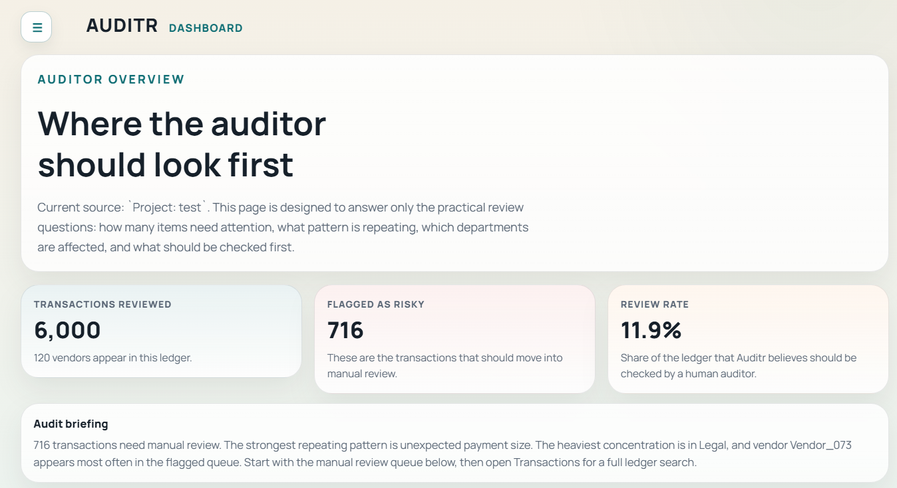
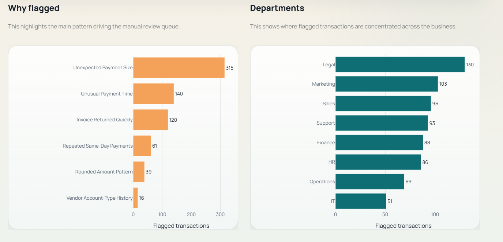
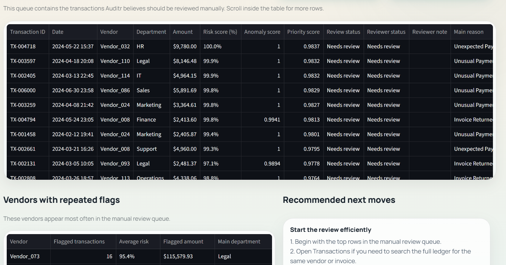
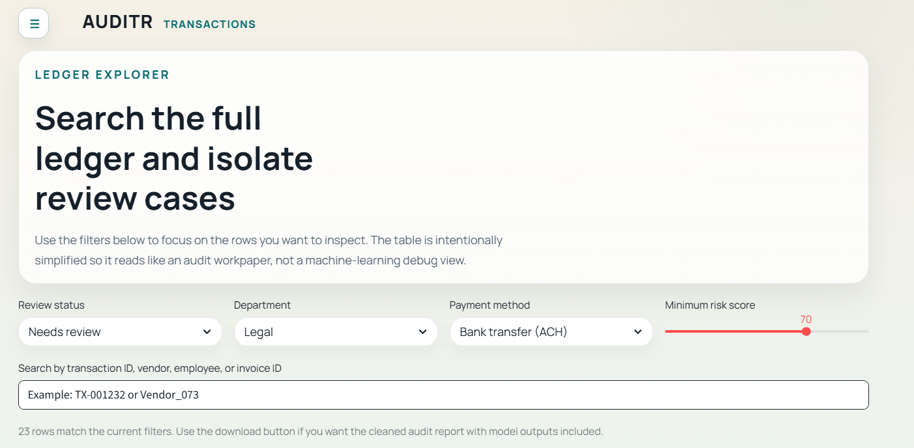
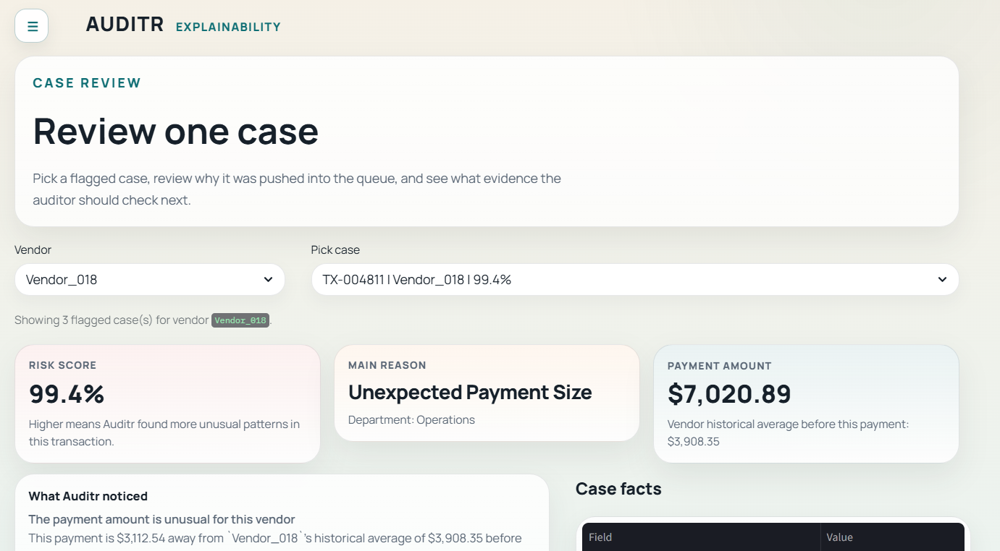
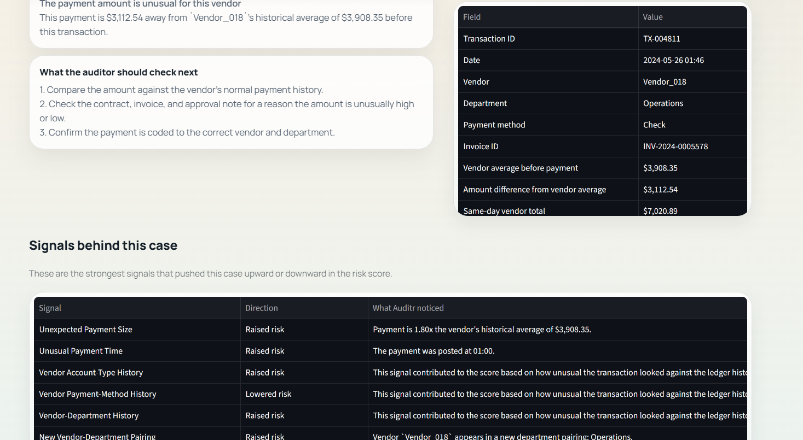

# AUDITR – Accounting Forensics & Fraud Detection System

An AI-assisted accounting forensics application that helps auditors identify high-risk financial transactions, prioritize manual reviews, and understand why a transaction has been flagged.

Developed as a Final Year B.Tech Data Science & Engineering project, Auditr combines anomaly detection, explainable AI techniques, and an auditor-focused interface to support fraud investigation workflows.

---

## Overview

Auditr is designed to reduce the time auditors spend manually reviewing thousands of ledger entries by automatically identifying unusual transactions and presenting supporting evidence in an easy-to-understand format.

Instead of acting as a replacement for auditors, the system serves as a decision-support tool that highlights suspicious activity and explains the factors contributing to each flagged case.

---

## Key Features

- AI-powered fraud risk scoring
- Intelligent manual review queue
- Transaction search and filtering
- Vendor-level anomaly analysis
- Explainable AI with human-readable reasoning
- Supporting evidence for flagged cases
- Risk-based prioritization of transactions
- Downloadable audit reports
- Interactive auditor dashboard
- Streamlit-based user interface

---

## Technology Stack

| Component | Technology |
|-----------|------------|
| Programming Language | Python |
| Frontend | Streamlit |
| Machine Learning | Scikit-learn |
| Data Processing | Pandas, NumPy |
| Visualizations | Plotly |
| Explainability | SHAP-inspired feature explanations |
| Dataset | Synthetic accounting transaction dataset |

---

# Application Preview

## Dashboard Overview

Provides auditors with an executive summary of flagged transactions, review rates, and overall audit status.



---

## Dashboard Insights

Displays fraud patterns, departmental concentration, vendor exposure, and major control signals identified during analysis.



---

## Manual Review Queue

Lists transactions requiring auditor attention, ranked by risk score and accompanied by review information.



---

## Transaction Search

Allows auditors to search and filter the complete ledger using multiple criteria including department, payment method, and risk threshold.



---

## Case Review

Provides a detailed explanation of an individual flagged transaction together with relevant business context.



---

## Explainability Signals

Displays the major signals that influenced the model's decision and explains why the transaction received its assigned risk score.



---

# Repository Structure

```
auditr-accounting-forensics-system
│
├── backend/
│   ├── demo/
│   ├── models/
│   └── training/
│
├── frontend/
│
├── docs/
│   └── screenshots/
│
├── output/
│
├── app.py
├── Launch Auditr.bat
├── accounting_fraud_dataset.csv
├── accounting_fraud_dataset_v2.csv
├── README.md
└── requirements.txt
```

---

# Running the Project

## 1. Clone the repository

```bash
git clone https://github.com/mhafna/auditr-accounting-forensics-system.git
```

## 2. Navigate into the project

```bash
cd auditr-accounting-forensics-system
```

## 3. Install dependencies

```bash
pip install -r requirements.txt
```

## 4. Launch the application

```bash
streamlit run app.py
```

Alternatively, Windows users may launch the application using:

```
Launch Auditr.bat
```

---

# Workflow

1. Load an accounting engagement.
2. Explore overall audit statistics from the dashboard.
3. Review the prioritized manual review queue.
4. Search the complete ledger using advanced filters.
5. Open a flagged transaction for detailed analysis.
6. Examine the explainability signals and supporting evidence.
7. Export reports for documentation and further review.

---

# Project Objective

The objective of Auditr is to support auditors by:

- Detecting unusual accounting transactions
- Prioritizing cases for manual review
- Providing transparent explanations for AI decisions
- Reducing review effort through intelligent filtering
- Improving consistency in fraud investigation workflows

---

# Dataset

The project uses a synthetic accounting transaction dataset created for educational and research purposes.

The repository includes both:

- `accounting_fraud_dataset.csv`
- `accounting_fraud_dataset_v2.csv`

which were used during development and testing.

---

# Disclaimer

This project was developed for academic purposes as part of a final year engineering project. It is intended as a proof-of-concept decision support system and should not be used as a substitute for professional financial auditing procedures.

---

# Author

**Maryam Hafna**

B.Tech Data Science & Engineering

GitHub: https://github.com/mhafna
